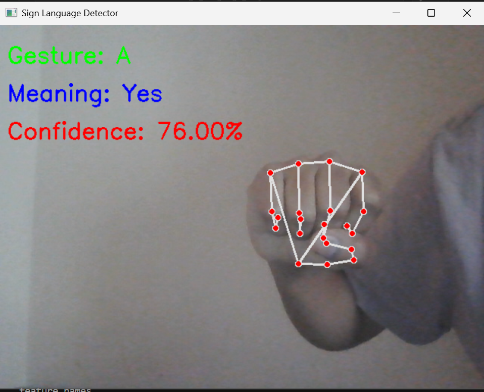
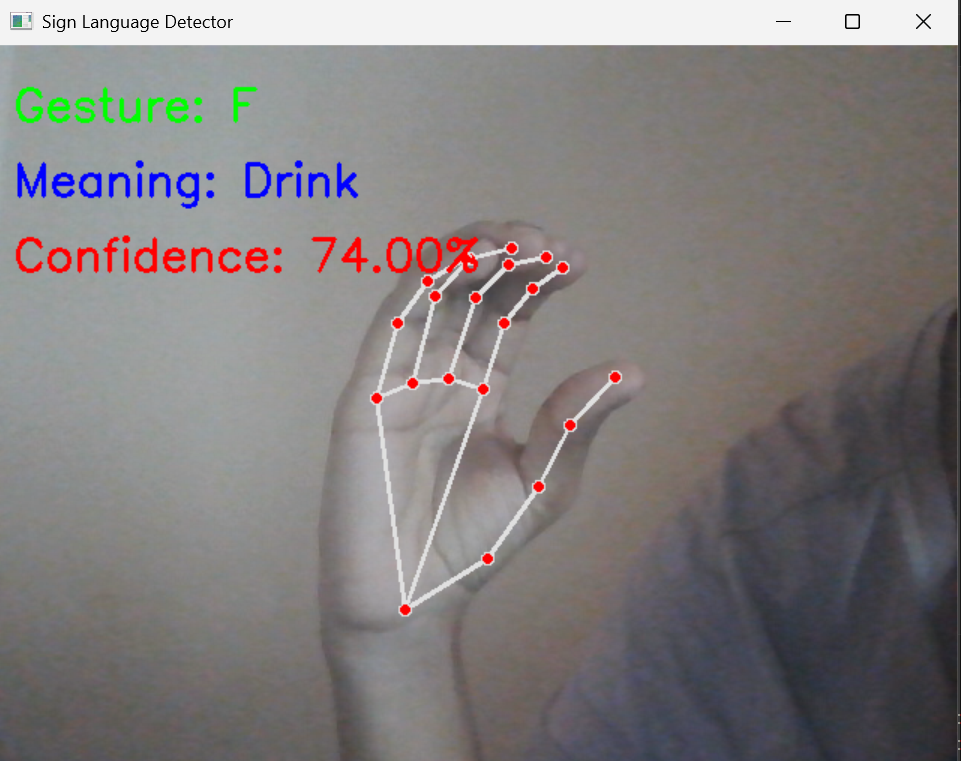
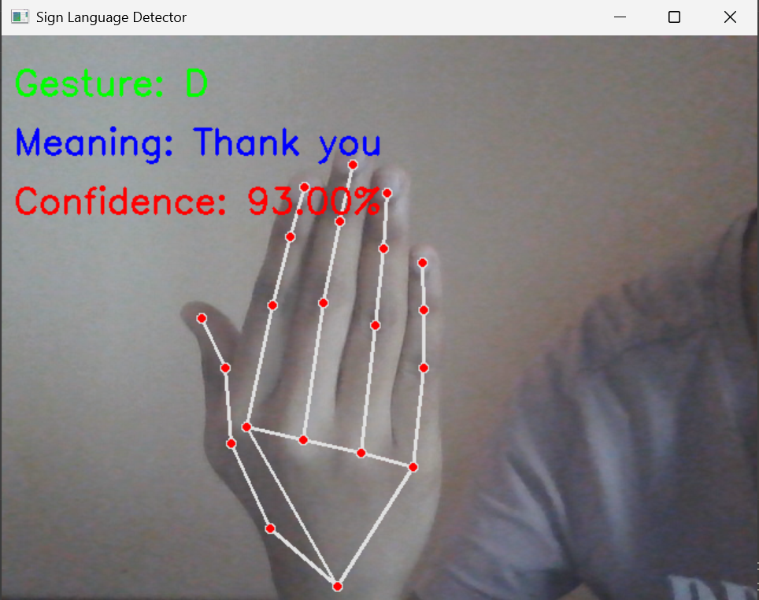
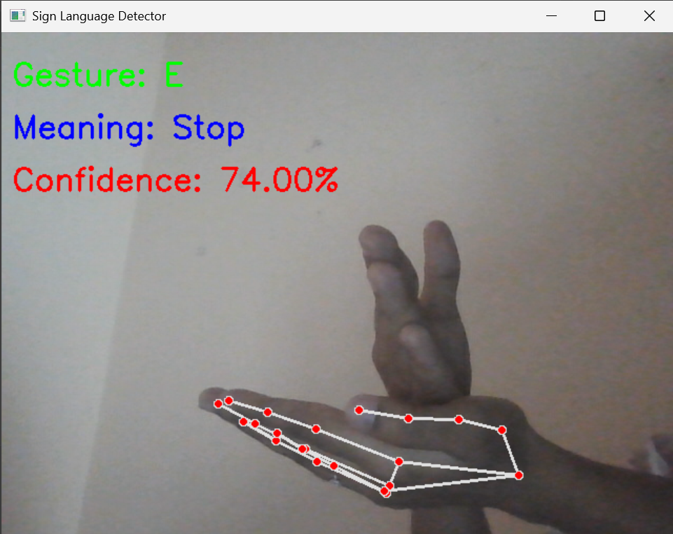
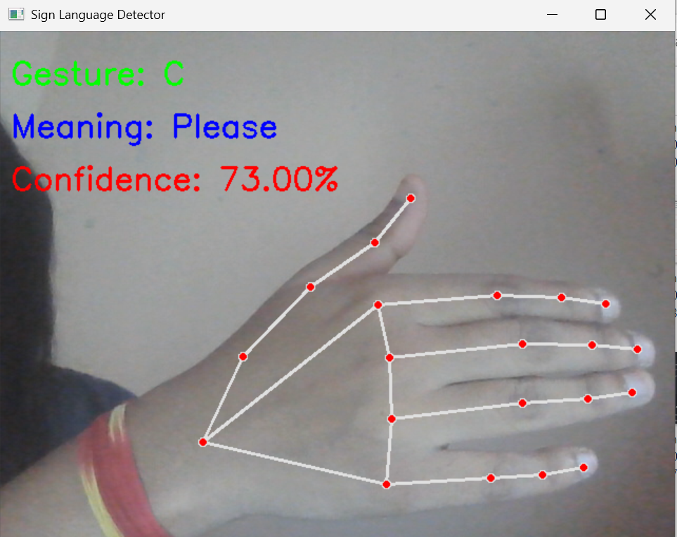

# 🤟 Sign Language Recognition System

A **real-time Sign Language Recognition System** built using **Python, OpenCV, and MediaPipe** that detects hand gestures through a webcam and converts them into meaningful text.

This project helps bridge the communication gap between **sign language users and non-sign language users** by automatically interpreting gestures in real time.

---

# 📌 Features

* ✋ Real-time **hand tracking** using MediaPipe
* 🤖 **Machine Learning gesture classification**
* 📷 Webcam-based gesture detection
* 🔤 Displays **gesture label and meaning**
* 📊 Shows **prediction confidence score**
* ⚡ Lightweight and runs in real time

---

# 🧠 Supported Gestures

| Gesture | Meaning   |
| ------- | --------- |
| A       | Yes       |
| F       | Drink     |
| D       | Thank You |
| E       | Stop      |
| C       | Please    |

---

# 🛠️ Tech Stack

* **Python**
* **OpenCV**
* **MediaPipe**
* **NumPy**
* **Scikit-learn**

---

# 📂 Project Structure

```
Sign-Language-Recognition
│
├── dataset/              # Gesture training dataset
├── models/               # Trained ML model
├── screenshots/          # Project output images
│
├── main.py               # Real-time gesture detection
├── train.py              # Model training script
├── requirements.txt      # Required libraries
└── README.md             # Project documentation
```

---

# 📸 Project Demo

## Gesture: Yes



## Gesture: Drink



## Gesture: Thank You



## Gesture: Stop



## Gesture: Please



---

# ⚙️ Installation

Clone the repository:

```
git clone https://github.com/Nithya-punugoti/Sign-Language-Recognition.git
```

Navigate to the project directory:

```
cd Sign-Language-Recognition
```

Install required dependencies:

```
pip install -r requirements.txt
```

---

# ▶️ Running the Project

Run the gesture detection program:

```
python main.py
```

Your **webcam will open**, and the system will detect hand gestures in real time.

Press **`q`** to exit the application.

---

# 📊 How It Works

1. **MediaPipe** detects hand landmarks from the webcam feed
2. Landmark coordinates are extracted as features
3. A **trained machine learning model** classifies the gesture
4. The predicted **gesture label, meaning, and confidence score** are displayed on screen

---

# 🚀 Future Improvements

* Add **more sign language gestures**
* Implement **text-to-speech output**
* Build a **web-based interface**
* Improve model accuracy with a larger dataset
* Support **full sign language sentence recognition**

---

# 👩‍💻 Author

**Nithya Sri**

Computer Science & Data Science Student
AI/ML Enthusiast | Problem Solver

GitHub:
https://github.com/Nithya-punugoti

---

# ⭐ If you like this project

Give this repository a **star ⭐** and share it with others!
